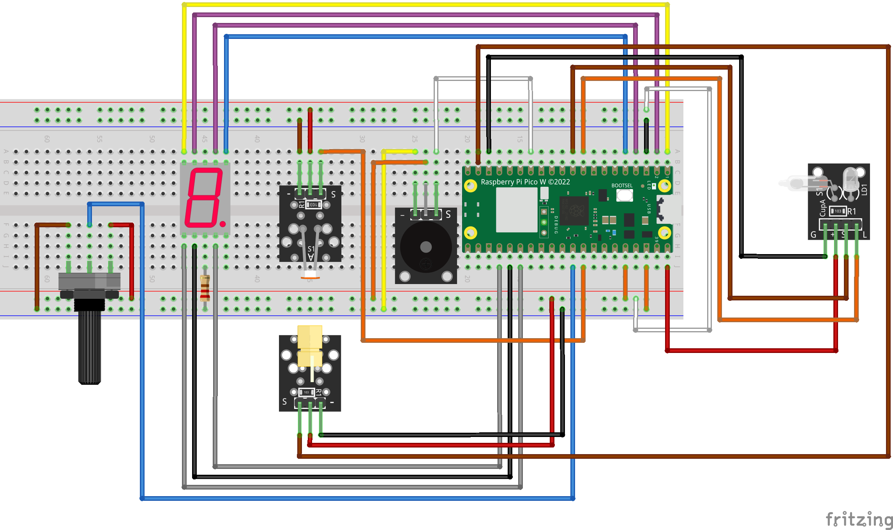

# Primer laboratorio de la cátedra Tecnologías para la Automatización
##### integrantes:
-Bianciotto, Joaquín

-Honnorat, Valentino

-Marain, Yoel Mario

-Rivero, Bruno Sebastián.

## Contexto
-Microcontrolador Raspberry Pi Pico 2 W

-Programado en CircuitPython

-Sistema de seguridad con láser y sensor de inclinación

-Al utilizarse también en un contexto de MQTT, el código necesita colocar SSID, contraseña de la red e IPv4 del broker para ejecutarse correctamente. En caso de no necesitarlo, se quitan las secciones asociadas a ello.